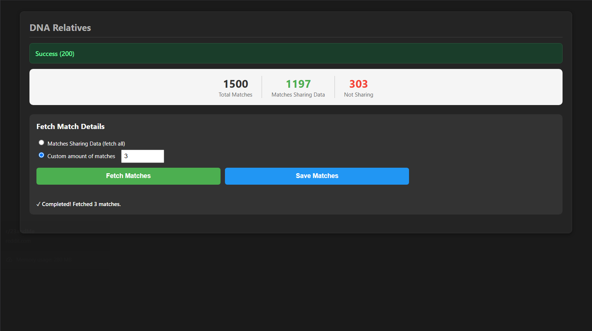

# MatchFetch — 23andMe Edition



MatchFetch is a Chrome extension that extracts and saves your 23andMe DNA match data for off-site analysis and research. It collects match details and ancestry composition data to make it easier to export, analyze, or archive your matches.

> Note: This extension is designed for personal use with your own 23andMe account. Use responsibly and follow 23andMe's Terms of Service and privacy rules. This project is not affiliated with 23andMe.

## Key features

- Extracts detailed match information from your 23andMe account pages
- Captures ancestry composition and related match metadata
- Saves results as local files for analysis

## Installation (developer / local)

1. Clone this repository:

```powershell
git clone https://github.com/strike978/matchfetch23.git
cd matchfetch23
```

2. Open Chrome and navigate to chrome://extensions
3. Enable "Developer mode" (top-right)
4. Click "Load unpacked" and select the repository folder (`matchfetch23`)
5. The extension should appear in the toolbar. Pin it if you like.

## Usage

1. Log into your 23andMe account in Chrome.
2. Navigate to the Matches or Ancestry pages you want to extract.
3. Click the extension icon to start extraction.
4. Follow any on-screen prompts. Output files will be saved locally (or as prompted) for your analysis.

## Example JSON Export

Here is a sample of the actual JSON data generated by MatchFetch (with demo names and profile ID):

```json
{
  "relative_profile_id": "demo123456789abc",
  "initials": "JS",
  "first_name": "JORDAN",
  "last_name": "SMITH",
  "surnames": ["Smith", "Otero", "Rivera"],
  "is_open_sharing": true,
  "sex": "male",
  "predicted_relationship_id": "half_first_cousin",
  "ibd_proportion": 0.0833,
  "num_segments": 31,
  "max_segment_length": 81.16715240478516,
  "is_maternal_side": true,
  "is_paternal_side": false,
  "grandparent_birth_locations": {
    "maternal_gma": {
      "city": "Ponce",
      "county": "Canas",
      "state": "Ponce",
      "country": "PR",
      "latitude": 18.0110768,
      "longitude": -66.6140616
    },
    "maternal_gpa": {
      "city": "Guayama",
      "county": "Jobos",
      "state": "Guayama",
      "country": "PR",
      "latitude": 17.9841328,
      "longitude": -66.1137767
    },
    "paternal_gma": {
      "city": null,
      "county": null,
      "state": null,
      "country": "PR",
      "latitude": 18.220833,
      "longitude": -66.590149
    },
    "paternal_gpa": {
      "city": null,
      "county": null,
      "state": null,
      "country": "PR",
      "latitude": 18.220833,
      "longitude": -66.590149
    }
  },
  "date_opted_in": "2019-05-23",
  "ancestry": {
    "using_latest_compute": true,
    "haplogroups": {
      "ydna": "R-CTS3402",
      "mtdna": "C1"
    },
    "regions": {
      "European": [
        {
          "id": "european",
          "label": "European",
          "totalPercent": "65.3",
          "color": "#80C3FF",
          "parent_id": "root",
          "regions": {
            "Spanish & Portuguese": [
              {
                "id": "iberian",
                "label": "Spanish & Portuguese",
                "totalPercent": "60.0",
                "color": "#4352AB",
                "parent_id": "european",
                "regions": {
                  "Andalusian, Asturian & Castilian": [
                    {
                      "id": "central_iberian",
                      "label": "Andalusian, Asturian & Castilian",
                      "totalPercent": "41.5",
                      "color": "#6F82E3",
                      "parent_id": "iberian"
                    }
                  ],
                  "Portuguese & Galician": [
                    {
                      "id": "west_iberian",
                      "label": "Portuguese & Galician",
                      "totalPercent": "16.7",
                      "color": "#5A6BC7",
                      "parent_id": "iberian"
                    }
                  ],
                  "Basque": [
                    {
                      "id": "north_iberian",
                      "label": "Basque",
                      "totalPercent": "1.1",
                      "color": "#485DD9",
                      "parent_id": "iberian"
                    }
                  ],
                  "Canary Islander": [
                    {
                      "id": "canarian",
                      "label": "Canary Islander",
                      "totalPercent": "0.5",
                      "color": "#394FC4",
                      "parent_id": "iberian"
                    }
                  ],
                  "Aragonese & Catalan": [
                    {
                      "id": "east_iberian",
                      "label": "Aragonese & Catalan",
                      "totalPercent": "0.2",
                      "color": "#223BE5",
                      "parent_id": "iberian"
                    }
                  ]
                }
              }
            ],
            "Italian & Maltese": [
              {
                "id": "italian",
                "label": "Italian & Maltese",
                "totalPercent": "2.8",
                "color": "#4364AD",
                "parent_id": "european",
                "regions": {
                  "Southern Italian": [
                    {
                      "id": "southern_italian",
                      "label": "Southern Italian",
                      "totalPercent": "2.5",
                      "color": "#3365DA",
                      "parent_id": "italian"
                    }
                  ],
                  "Maltese": [
                    {
                      "id": "maltese",
                      "label": "Maltese",
                      "totalPercent": "0.3",
                      "color": "#6F92E3",
                      "parent_id": "italian"
                    }
                  ]
                }
              }
            ],
            "Western European": [
              {
                "id": "french_german",
                "label": "Western European",
                "totalPercent": "1.2",
                "color": "#4371AD",
                "parent_id": "european",
                "regions": {
                  "Swiss, Southwestern German & Western Austrian": [
                    {
                      "id": "central_german",
                      "label": "Swiss, Southwestern German & Western Austrian",
                      "totalPercent": "1.0",
                      "color": "#377CD8",
                      "parent_id": "french_german"
                    }
                  ],
                  "Austrian & Southern German": [
                    {
                      "id": "south_german",
                      "label": "Austrian & Southern German",
                      "totalPercent": "0.2",
                      "color": "#6FA1E3",
                      "parent_id": "french_german"
                    }
                  ]
                }
              }
            ],
            "Ashkenazi Jewish": [
              {
                "id": "ashkenazi",
                "label": "Ashkenazi Jewish",
                "totalPercent": "0.7",
                "color": "#22BFE5",
                "parent_id": "european"
              }
            ],
            "British & Irish": [
              {
                "id": "british_irish",
                "label": "British & Irish",
                "totalPercent": "0.6",
                "color": "#4482AD",
                "parent_id": "european",
                "regions": {
                  "Welsh": [
                    {
                      "id": "welsh",
                      "label": "Welsh",
                      "totalPercent": "0.6",
                      "color": "#3697DC",
                      "parent_id": "british_irish"
                    }
                  ]
                }
              }
            ]
          }
        }
      ],
      "Sub-Saharan African": [
        {
          "id": "african",
          "label": "Sub-Saharan African",
          "totalPercent": "17.0",
          "color": "#B580FF",
          "parent_id": "root",
          "regions": {
            "West African": [
              {
                "id": "west_african",
                "label": "West African",
                "totalPercent": "10.1",
                "color": "#6743AD",
                "parent_id": "african",
                "regions": {
                  "Senegambian & Guinean": [
                    {
                      "id": "senegambian_guinean",
                      "label": "Senegambian & Guinean",
                      "totalPercent": "7.4",
                      "color": "#6423E6",
                      "parent_id": "west_african"
                    }
                  ],
                  "Nigerian": [
                    {
                      "id": "nigerian",
                      "label": "Nigerian",
                      "totalPercent": "2.7",
                      "color": "#8653ED",
                      "parent_id": "west_african"
                    }
                  ]
                }
              }
            ],
            "Congolese & Southern East African": [
              {
                "id": "bantu",
                "label": "Congolese & Southern East African",
                "totalPercent": "6.9",
                "color": "#7944AE",
                "parent_id": "african",
                "regions": {
                  "Angolan & Congolese": [
                    {
                      "id": "congolese_bantu",
                      "label": "Angolan & Congolese",
                      "totalPercent": "6.9",
                      "color": "#8422E5",
                      "parent_id": "bantu"
                    }
                  ]
                }
              }
            ]
          }
        }
      ],
      "Indigenous American": [
        {
          "id": "american",
          "label": "Indigenous American",
          "totalPercent": "16.5",
          "color": "#FF80EC",
          "parent_id": "root",
          "regions": {
            "North American": [
              {
                "id": "north_mesoamerican",
                "label": "North American",
                "totalPercent": "7.0",
                "color": "#ED53AA",
                "parent_id": "american"
              }
            ],
            "Northern Andean": [
              {
                "id": "ecuadorian",
                "label": "Northern Andean",
                "totalPercent": "5.4",
                "color": "#C73CD9",
                "parent_id": "american"
              }
            ],
            "Southern Mesoamerican": [
              {
                "id": "central_american",
                "label": "Southern Mesoamerican",
                "totalPercent": "3.1",
                "color": "#E51BB9",
                "parent_id": "american"
              }
            ],
            "Central Andean & Amazonian": [
              {
                "id": "south_american",
                "label": "Central Andean & Amazonian",
                "totalPercent": "1.0",
                "color": "#ED53EB",
                "parent_id": "american"
              }
            ]
          }
        }
      ],
      "Western Asian & North African": [
        {
          "id": "wana",
          "label": "Western Asian & North African",
          "totalPercent": "0.9",
          "color": "#9580FF",
          "parent_id": "root",
          "regions": {
            "Arab, Egyptian & Levantine": [
              {
                "id": "arabian_egyptian_levantine",
                "label": "Arab, Egyptian & Levantine",
                "totalPercent": "0.6",
                "color": "#5543AD",
                "parent_id": "wana",
                "regions": {
                  "Peninsular Arab": [
                    {
                      "id": "arabian",
                      "label": "Peninsular Arab",
                      "totalPercent": "0.6",
                      "color": "#4422E5",
                      "parent_id": "arabian_egyptian_levantine"
                    }
                  ]
                }
              }
            ],
            "North African": [
              {
                "id": "north_african",
                "label": "North African",
                "totalPercent": "0.3",
                "color": "#5E39C4",
                "parent_id": "wana"
              }
            ]
          }
        }
      ],
      "Central & South Asian": [
        {
          "id": "south_asian",
          "label": "Central & South Asian",
          "totalPercent": "0.3",
          "color": "#9CFF6B",
          "parent_id": "root",
          "regions": {
            "Northern Indian & Pakistani": [
              {
                "id": "north_indian_pakistani",
                "label": "Northern Indian & Pakistani",
                "totalPercent": "0.3",
                "color": "#BDE51B",
                "parent_id": "south_asian"
              }
            ]
          }
        }
      ]
    }
  }
}
```

## Security & privacy

- This extension requires access only to cookies and pages on `*.23andme.com` to collect match data.
- The extension stores data locally; it does not transmit data to external servers (unless you add such functionality).
- Do not share exported match files without consent from the people they reference.

## Contributing

Contributions, bug reports, and feature requests are welcome. Please open an issue or submit a PR. When contributing, include:

- A clear description of the change
- Steps to reproduce (for bugs)
- Small, focused commits

---
